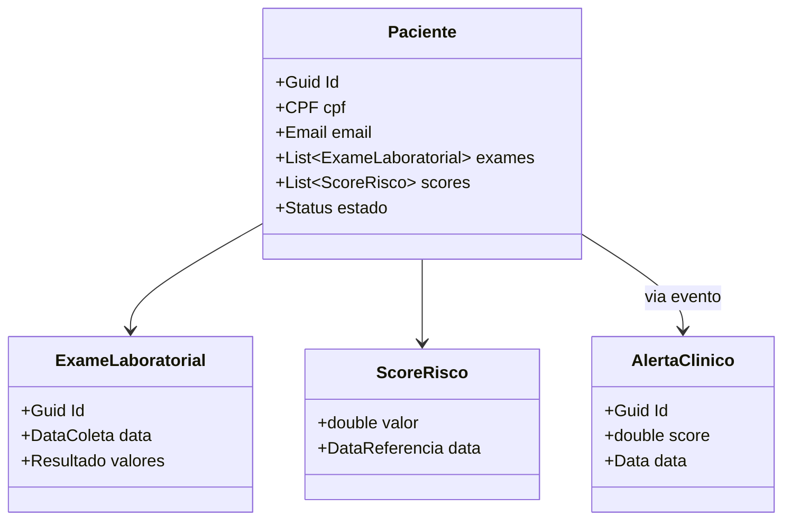

# 📚 Trabalho de Domain-Driven Design (DDD)

## Projeto: Plataforma de Detecção Precoce e Monitoramento de Risco para Doença Renal Crônica (DRC)
Autores: Andressa Lemes, Kaique Santos, Larissa Silva Ramos, Leonardo Almeida do Carmo

---

# 🌐 Parte 1 — Design Estratégico

## 1. Nome do Projeto
Plataforma de Detecção Precoce e Monitoramento de Risco para Doença Renal Crônica

## 2. Objetivo Principal
Detectar precocemente risco de DRC e apoiar o acompanhamento longitudinal de pacientes na atenção básica, integrando dados clínicos e laboratoriais para priorizar triagem, disparar alertas e coordenar encaminhamentos antes de evolução para terapia renal substitutiva.

## 3. Identificação dos Subdomínios
(Core, Supporting e Generic)  
*(baseado no arquivo DDD_1)*

| Subdomínio | Descrição | Tipo |
|------------|-----------|------|
| Gestão de Risco & Triagem | Calcula risco de DRC, identifica população elegível para rastreio e prioriza casos. | Core |
| Modelos Preditivos de Progressão | Prediz progressão/agravamento e janela ótima de intervenção. | Core |
| Orquestração de Rastreamento | Agenda janelas de rastreio, solicita exames e acompanha pendências. | Core |
| Gestão de Casos & Plano de Cuidado | Registra plano individual, consolida alertas clínicos. | Supporting |
| Integração com Laboratórios/EHR | Ingestão de exames, conciliação de identidades. | Supporting |
| Cadastro, Consentimento & LGPD | Identificação de paciente/profissional e gestão de consentimentos. | Supporting |
| Notificações & Engajamento | Lembretes de coleta/consulta e adesão. | Supporting |
| Relatórios Epidemiológicos & KPIs | Métricas de cobertura, tempo até diagnóstico, custos evitados. | Supporting |
| Terminologias & Catálogo Clínico | Mapas de códigos (LOINC, CID-10, SIGTAP). | Generic |
| Pagamentos/Autorização SUS | Regras para autorizar/registrar exames. | Generic |
| Identidade & Acesso | Autenticação/autorização e perfis de acesso. | Generic |
| Observabilidade & Plataforma | Logs, métricas, tracing, CI/CD/MLops. | Generic |

## 4. Bounded Contexts
*(resumido a partir do DDD_1)*

- **Contexto de Risco e Triagem** → calcula risco e prioriza pacientes.  
- **Contexto Preditivo** → treina e serve modelos de progressão da DRC.  
- **Contexto de Rastreamento** → agenda e acompanha exames.  
- **Contexto de Casos Clínicos** → mantém planos de cuidado e alertas.  
- **Contexto de Integração Clínica** → concilia dados laboratoriais.  
- **Contexto de Cadastro & LGPD** → gerencia identidade e consentimento.  
- **Contexto de Engajamento** → envia notificações multicanal.  
- **Contexto de Relatórios** → gera dashboards e KPIs.  
- **Contexto de Plataforma** → suporte de logs, métricas e infraestrutura.  
- **Contexto de Procedimentos SUS** → valida autorização de exames.  

## 5. Comunicação entre Contextos
- Eventos assíncronos (Kafka) → risco → rastreamento → casos clínicos.  
- APIs síncronas → consulta imediata (ex.: `GET /score-risco/{pacienteId}`).  
- Batch/Pipelines → alimentar modelos preditivos e relatórios epidemiológicos.  

## 6. Linguagem Ubíqua
- **Paciente**: pessoa monitorada.  
- **População-Alvo**: elegíveis para rastreio (DM2, HAS, >60 anos).  
- **Risco DRC**: probabilidade estimada de desenvolver/progredir.  
- **Janela de Rastreamento**: período recomendado para exames.  
- **Alerta Clínico**: sinal gerado por regra/modelo (queda rápida de TFG).  
- **Plano de Cuidado**: conjunto de metas, exames, consultas.  
- **Evento-Sentinela**: evento crítico (início de diálise, internação).  
- **KPIs de Programa**: métricas de rastreio, diagnóstico precoce, custos evitados.  

---

# ⚙️ Parte 2 — Design Tático

*(preenchido com base no template do arquivo DDD_3)*

## 🩺 1) Sobre o Domínio Escolhido
**Nome do domínio:** Detecção Precoce e Monitoramento da Doença Renal Crônica  
**Objetivo do sistema:** Identificar pacientes em risco de DRC e apoiar acompanhamento clínico antes de progressão grave.  
**Principais atores:** Paciente, Médico da Atenção Básica, Laboratório, Gestor de Saúde.  
**Contextos:** Risco e Triagem, Rastreamento, Casos Clínicos, Engajamento, Relatórios.  

---

## 🧩 2) Entidades vs Value Objects

| Elemento           | Tipo            | Por quê? |
|--------------------|-----------------|----------|
| Paciente           | Entidade        | Possui identidade única (ID). |
| ExameLaboratorial  | Entidade        | Cada exame tem identidade e data. |
| ScoreRisco         | Value Object    | Imutável, resultado de cálculo. |
| CPF                | Value Object    | Identificação única, imutável. |
| E-mail             | Value Object    | Contato para notificações, imutável. |

---

## 🏗️ 3) Agregados e Aggregate Root (AR)
**Agregado Principal:** Paciente  
**AR:** Paciente  
**Conteúdo interno:** dados cadastrais, exames, scores de risco.  
**Referências externas:** IDs de notificações, relatórios epidemiológicos.  

**Boundary:**  
- Dentro: exames e scores (consistência imediata).  
- Fora: notificações, relatórios (eventual consistency).  

---

## 🧭 4) Invariantes e Máquina de Estados
**Invariantes:**  
- Um paciente não pode ter dois CPFs diferentes.  
- Score de risco ∈ [0,1].  
- ExameLaboratorial deve ter data válida.  
- Não emitir alerta sem paciente associado.  

**Estados e transições:**  
```
Não Monitorado -> Em Risco Detectado -> Acompanhamento Ativo -> Alta/Óbito

Transição A: Não Monitorado → Em Risco (quando ScoreRisco > limiar).  
Transição B: Em Risco → Acompanhamento (se médico confirma necessidade).  
Transição C: Acompanhamento → Alta/Óbito (encerramento do caso).  
```

---

## 🗃️ 5) Repositório do Agregado
```csharp
public interface IPacienteRepository
{
    Task<Paciente?> ObterPorIdAsync(Guid id, CancellationToken ct = default);
    Task AdicionarAsync(Paciente paciente, CancellationToken ct = default);
    Task SalvarAsync(Paciente paciente, CancellationToken ct = default);
}
```

---

## 📣 6) Eventos de Domínio

| Evento                | Quando ocorre                               | Payload mínimo            | Interno/Integração | Observações |
|------------------------|---------------------------------------------|---------------------------|--------------------|-------------|
| PacienteCadastrado     | Novo paciente registrado                   | {PacienteId, CPF, Email} | Integração         | Aciona rastreamento inicial |
| ExameRegistrado        | Exame vinculado a paciente                 | {PacienteId, ExameId}    | Interno            | Atualiza estado clínico |
| ScoreRiscoGerado       | Modelo calcula risco                       | {PacienteId, Score}      | Interno            | Pode disparar alerta |
| AlertaClinicoEmitido   | Score ultrapassa limiar crítico            | {PacienteId, Score}      | Integração         | Notificação a médico e paciente |

---

## 🗺️ 7) Diagrama (Mermaid)


---

## ✅ Checklist de Aceitação
- ✅ VOs imutáveis (CPF, Email, ScoreRisco).  
- ✅ Boundaries de agregados pequenos e consistentes.  
- ✅ Domínio rico (regras encapsuladas nas entidades).  
- ✅ Repositório foca apenas na Aggregate Root.  

---

# 📤 Entrega

[Abrir documento no Google Drive](https://drive.google.com/file/d/1SlnXsf1FBGApyUSL1RKuAJgb0jxRGdFQ/view?usp=sharing)

